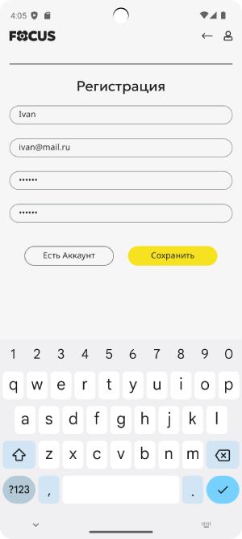
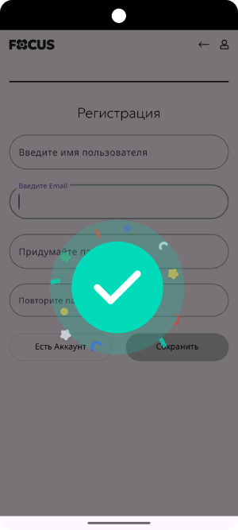

# Registration App

Android-приложение для регистрации пользователей с локальным сохранением и валидацией данных.

## Функциональность

- Ввод имени пользователя, email и пароля
- Валидация email, пароля и имени пользователя
- Проверка совпадения пароля и подтверждения пароля
- Проверка уникальности email и имени пользователя
- Анимация успешной регистрации (Lottie)
- Отображение ошибок и состояний через UI
- Локальное хранение зарегистрированных пользователей в базе Room

## Архитектура

- **MVVM** — ViewModel управляет логикой и состоянием
- **StateFlow / SharedFlow** — реактивное обновление UI
- **UseCase слой** — бизнес-логика отделена от представления
- **Hilt** — внедрение зависимостей
- **Material Design** — поля ввода, кнопки, визуальные эффекты
- **Room** — база данных SQLite для хранения пользователей
- **Lottie** — JSON-анимации для визуальной обратной связи

## Запуск проекта

1. Клонируй репозиторий:

```bash

git clone https://github.com/ChetireBanana/registration-app.git

````

2. Открой проект в Android Studio
3. Запусти приложение на эмуляторе или реальном устройстве

## Используемые технологии и зависимости

* Kotlin
* AndroidX (Core, AppCompat, Lifecycle, Fragment и др.)
* Material Components
* Hilt (Dagger) — для внедрения зависимостей
* Coroutine Flow (StateFlow и SharedFlow)
* Room — локальная база данных
* Lottie — анимации

## Скриншоты

<h3>Галерея скриншотов</h3>

<p float="left">
  
  
  
</p>

## Лицензия

Проект создан для обучения и демонстрации архитектурных принципов.
Лицензия MIT или другая по желанию автора.


